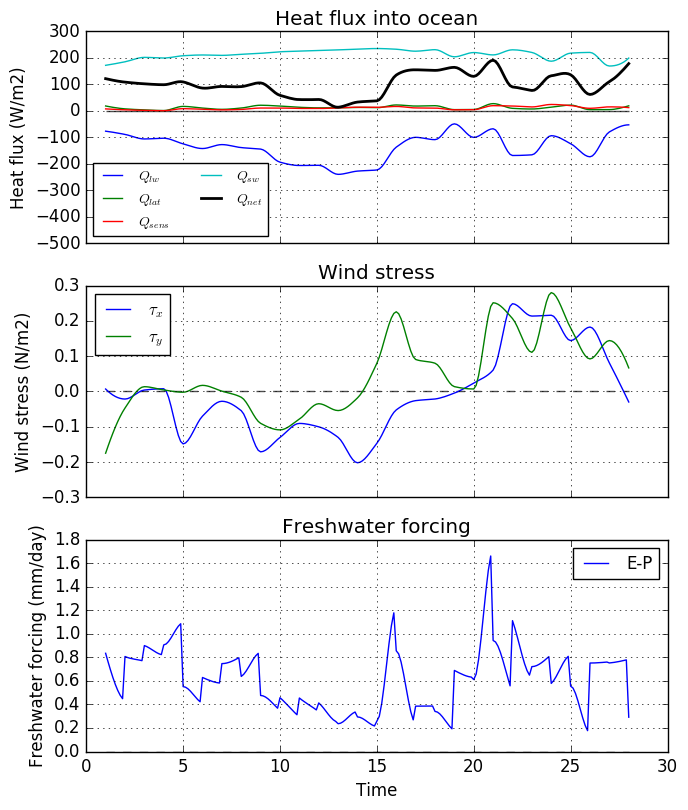
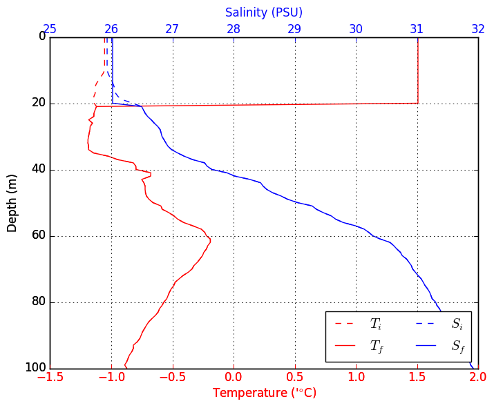

## Description

This is a Python implementation of the Price Weller Pinkel ([PWP](https://hycom.org/attachments/067_pwp.pdf)) ocean mixed layer model. This code is based on the MATLAB implementation of the PWP model written/modified by Byron Kilbourne (University of Washington) and Sarah Dewey (University of Washington).  I did this re-write as a personal exercise, so I would be very cautious about using this code to do any serious work. 

The code presented here is functionally similar to *PWP_Byron.m* (see *matlab_files/*). However, I made significant changes to the overall code organization. One big difference is that this code is split into two files. The main file, *PWP.py*, contains the core numerical algorithms for the PWP model. These numerical algorithms are mostly line-by-line translations of their MATLAB equivalents. The second file, *PWP_helper.py*, contains helper functions to facilitate model initialization, output analysis and other miscellaneous tasks. 

To run the code, you can type `%run PWP.py` from the iPython command line. This calls the `PWP.run()` function, which is the main function for the script. Alternatively, you can import PWP.py as a module then run the model directly:

```
import PWP
PWP.run()
```

This approach allows you to modify the model settings and parameters:

```
p={}
p['rkz'] = 1e-5 #diff coeff.
p['dz'] = 2 #vertical res (m)
p['dt'] = 6 #time step (hrs)
PWP.run(met_data='somewhere_else.nc', overwrite=False, param_kwds=p )
```

To get a feel for how this code/model is organized, the `PWP.run()` function would be a good place to start. This function has a fairly detailed doc-file, so it should be self-explanatory. 

This repository also contains sample surface forcing and initial profile data files. These are summertime data from the Beaufort Sea, courtesy of Sarah Dewey. If you copy this repository to a local directory, you should be able to run the model immediately - provided you have all the necessary modules.  

### Required modules/libraries
To run this code, you'll need Python 2.7 (some earlier versions might work) and the following libraries:

+ Ipython
+ Numpy
+ Scipy
+ Matplotlib
+ [xray](http://xray.readthedocs.org/en/v0.5/why-xray.html)
+ seawater

The first four are available with the popular python distributions such as [Anaconda](https://www.continuum.io/downloads) and [Canopy](https://store.enthought.com/downloads/#default). To get the other two, you can do pip install from a unix command line:

```
pip install xray
pip install seawater
```

### Example output



The plots above show the sample surface forcing data stored in the *met.nc*. These data represent summertime surface conditions over the Beaufort Sea.



The plot above compares initial (dashed lines) and final (solid) salinity and temperature profiles. This is with diffusion turned off (i.e. `rkz=0`).


Same as above but with the vertical diffusion co-efficient (`rkz`) set to 1x10<sup>-5</sup> m<sup>2</sup>/s.